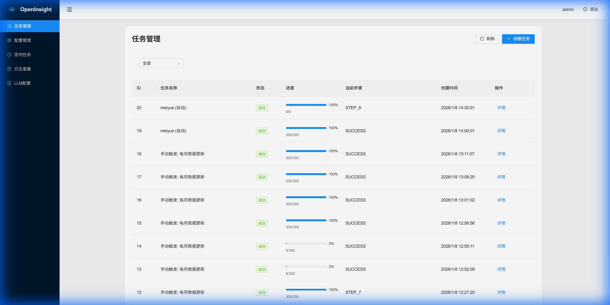

<div align="center">
  
  <h1>OpenInsight</h1>
  <p><strong>基于 X-lab OpenDigger 的开源项目趋势分析平台</strong></p>

  [](LICENSE)
  [](https://vuejs.org/)
  [](https://www.typescriptlang.org/)
  [](https://nodejs.org/)

  [视频演示](https://www.bilibili.com/video/BV1QQ6mBWEyn/) | [在线体验](https://openinsight.aihubzone.cn) | [指标说明](https://openinsight.aihubzone.cn/metrics-guide) | [使用文档](使用文档.md)
</div>

---

## 📖 项目简介

**OpenInsight** 是一个智能化开源项目全景洞察平台。它依托 **X-lab OpenDigger** 提供的海量开源元数据，旨在解决当前开源生态中“数据孤岛”、“评估维度单一”和“理解门槛高”等痛点。

通过独创的多维评估模型（GitHub 指数、PREI 指数、OpenRank），结合高性能可视化大屏与 AI 智能分析，OpenInsight 为开发者技术选型、企业开源治理及投资者价值评估提供精准、客观的数据支持。

### ✨ 核心特性

- **多维指标评估**：综合 Influence, Reaction, Developer, Trend 四大维度的 GitHub 指数，以及 OpenRank 全域影响力评估。
- **动态交互大屏**：基于 ECharts 的高性能可视化图表，支持趋势分析、雷达图对比与Top榜单查看。
- **AI 智能洞察**：集成 DeepSeek/Qwen 等大模型，自动诊断项目健康度，生成自然语言分析报告。
- **全链路开发**：提供项目搜素、数据 ETL、持久化存储到前端展示的完整解决方案。
- **自动化运维**：内置可视化 Cron 任务调度与系统日志监控，确保数据流转稳定。

---

## 📸 功能展示与使用指南

### 1. 项目搜索与导入

在首页输入 GitHub 项目的 Owner 和 Repo 名，点击“检查项目”。系统会自动查询数据源并触发 ETL 流程。
- **场景**：快速查看感兴趣的项目是否已被收录。


### 2. 可视化数据看板
项目详情页展示了核心指标的趋势变化。
- **OpenRank**：查看项目的长期生态影响力。
- **雷达图**：从六个维度（OpenRank, Activity, Attention 等）综合评估项目。


### 3. AI 智能分析
点击“智能分析”，系统调用大模型对当前项目的指标进行深度解读，生成包含“现状总结”、“风险预警”的详细报告。


---

## 🏗️ 系统架构

OpenInsight 采用前后端分离的现代化架构设计：

### 技术栈
*   **前端**: Vue 3, TypeScript, Vite, Pinia, Ant Design Vue, ECharts 5
*   **后端**: Node.js, Express, MySQL 8.0
*   **数据源**: X-lab OpenDigger (ClickHouse)

### 核心模块
1.  **数据采集层**: 定时从 OpenDigger 拉取 ClickHouse 数据。
2.  **业务逻辑层**: 处理 API 请求，执行 ETL 清洗，调用 AI 模型接口。
3.  **展示层**: 响应式 Web 应用，适配 PC 与移动端。

---

## 🚀 快速开始

### 环境要求
*   Node.js >= 18.0.0
*   MySQL >= 8.0
*   npm >= 9.0.0

### 1. 后端部署

```bash
# 进入后端目录
cd backend

# 安装依赖
npm install

# 配置数据库连接
# 修改 db/index.js 中的 MySQL配置 (host, user, password, database)

# 初始化数据库
# 请将 backend/database/ 下的 SQL 文件导入您的 MySQL 数据库

# 启动服务
npm start
# 服务运行在 http://localhost:3000
```

### 2. 前端部署

```bash
# 进入前端目录
cd frontend

# 安装依赖
npm install

# 配置环境变量 (.env.development)
# VITE_API_BASE_URL=http://localhost:3000/api

# 启动开发服务器
npm run dev
# 访问 http://localhost:5173
```

### 3. 后台管理系统
访问 `/admin` 路径进入后台。
*   **默认账号**: `admin`
*   **默认密码**: `password123`
*   **功能**: 可以在后台配置 AI 模型参数、查看系统日志及管理定时任务。




---

## 🤝 参与贡献

我们欢迎任何形式的贡献！
1.  Fork 本仓库。
2.  创建您的特性分支 (`git checkout -b feature/AmazingFeature`)。
3.  提交更改 (`git commit -m 'Add some AmazingFeature'`)。
4.  推送到分支 (`git push origin feature/AmazingFeature`)。
5.  提交 Pull Request。

请确保遵循项目的 [代码规范](.github/CONTRIBUTING.md)。

## 📄 开源协议

本项目采用 [MIT License](LICENSE) 协议。

---
<div align="center">
  Made with by OpenInsight Team
</div>
