# OpenInsight 使用手册

本文档提供 OpenInsight 平台的详细操作指南，涵盖前端数据可视化与后台管理系统的核心功能。

## 一、 前端功能指南

### 1. 项目搜索与导入
在首页搜索框输入 GitHub 项目的 `Owner`（所有者）和 `Repo`（仓库名），点击“检查项目”。系统会自动查询 X-lab OpenDigger 数据源。
- 如果项目已存在于数据库，直接跳转至分析大屏。
- 如果项目未导入，系统将触发 ETL 流程进行数据采集与计算（首次导入可能需要几秒钟）。

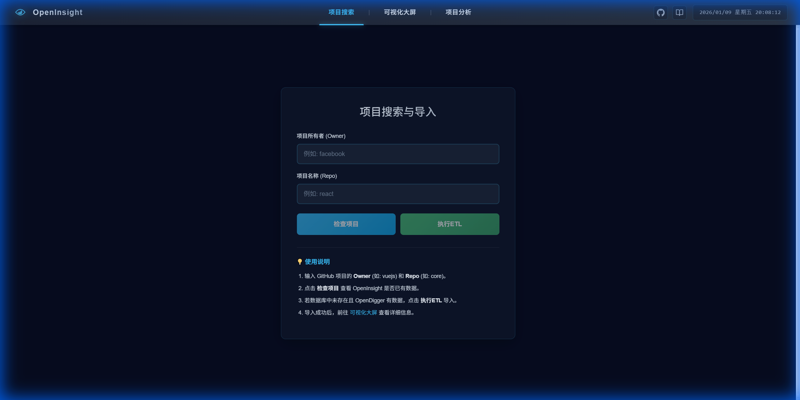

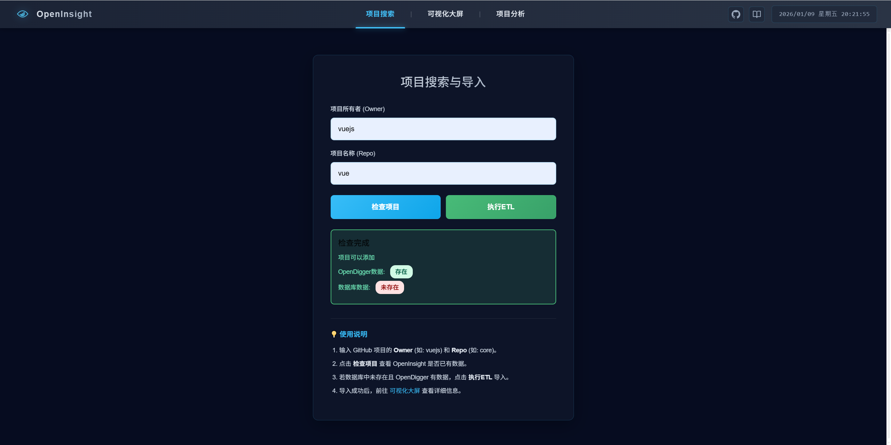

### 2. 可视化大屏
进入项目详情页后，您可以看到多维度的可视化图表：
- **OpenRank 趋势**：展示项目的长期影响力变化。
- **活跃度指标**：Issue、PR、Commit 的月度统计。
- **雷达图**：从 OpenRank、Activity、Attention 等六个维度评估项目健康度。
- **排行榜**：查看当前数据库中 Top 项目的各项指标排名。

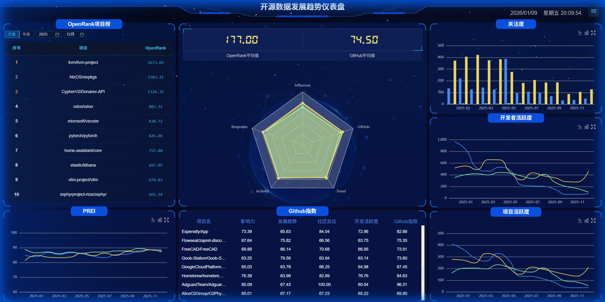

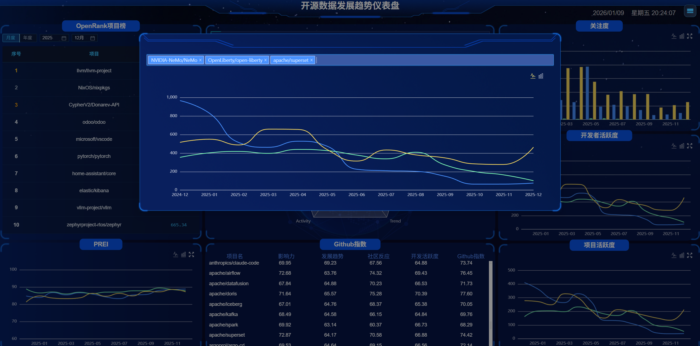

### 3. AI 智能分析
点击顶部导航栏的“智能分析”或项目详情页的“AI 报告”按钮，进入 AI 分析模块。
- 系统会根据当前项目的各项指标数据，调用大模型（可选 DeepSeek、通义千问等）生成自然语言诊断报告。
- 报告涵盖：项目现状总结、社区健康度评估、潜在风险预警及运营建议。

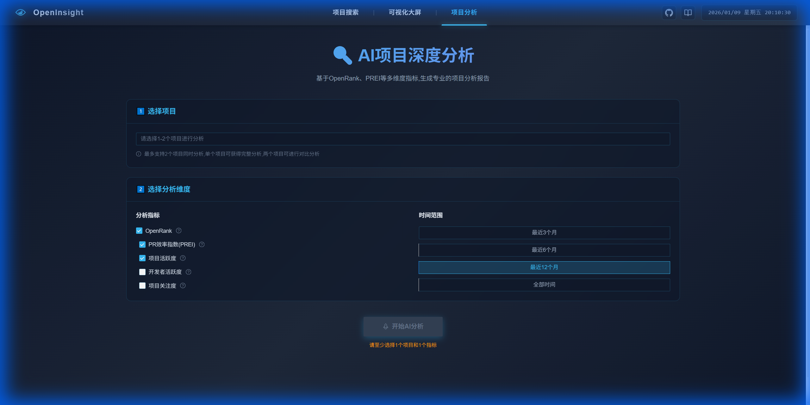

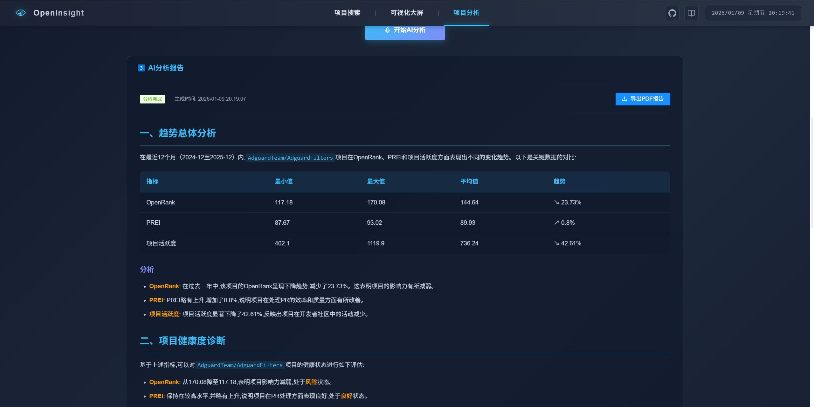

---

## 二、 后台管理指南

### 1. 管理员登录
使用管理员账号登录后台系统。

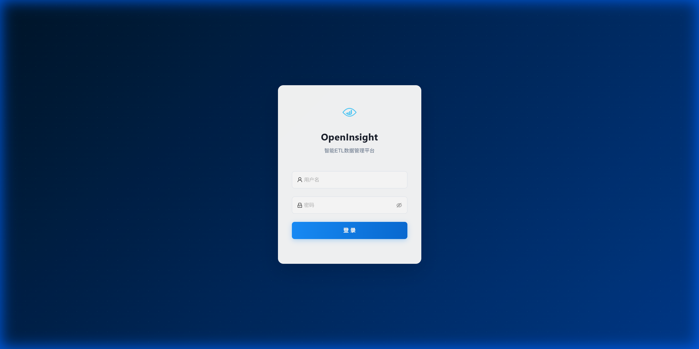

### 2. 功能管理
登录成功后，您可以进行以下操作：

#### 2.1 任务调度 (Task Scheduling)
- 查看系统定时任务（如每日数据同步、榜单更新）的运行状态。
- 支持手动触发特定任务或暂停任务。
- `Cron` 表达式可视化编辑器，方便配置任务周期。

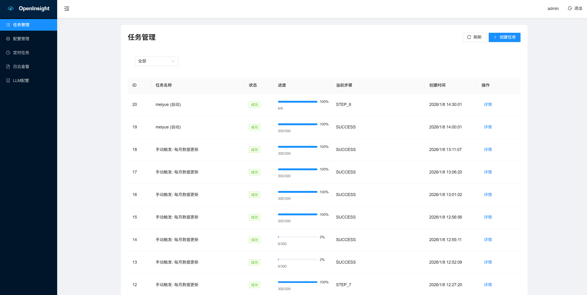

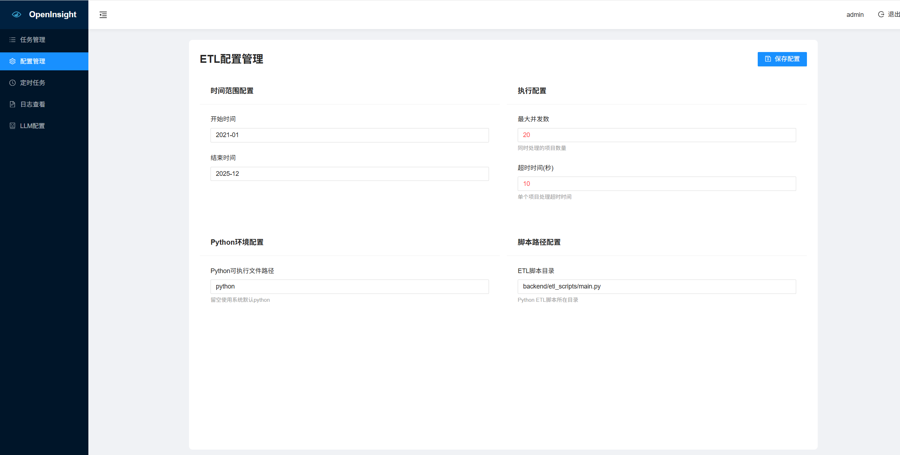

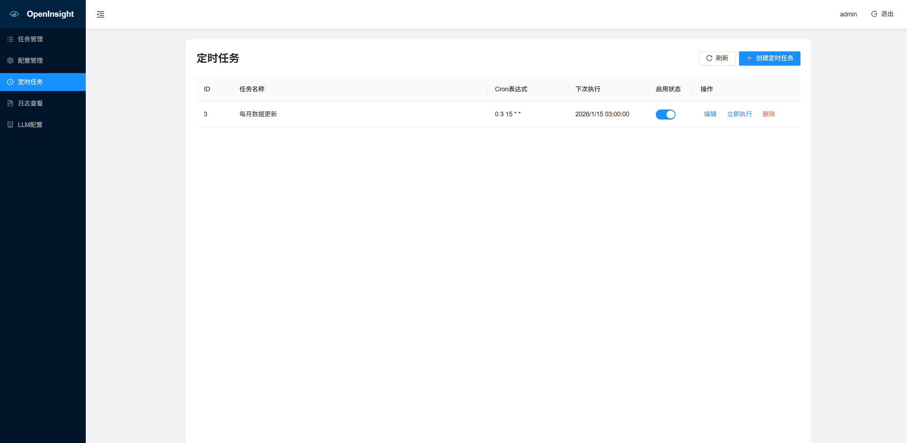

#### 2.2 系统日志 (System Logs)
- 实时查看 ETL 流程日志、API 调用记录和错误堆栈。
- 支持按时间范围和日志级别筛选。

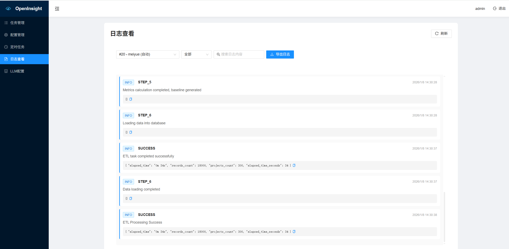

#### 2.3 模型配置 (Model Config)
- 动态切换 AI 分析所使用的底层大模型（DeepSeek / Qwen / OpenAI）。
- 配置 API Key 及请求参数（Temperature, Check_interval）。

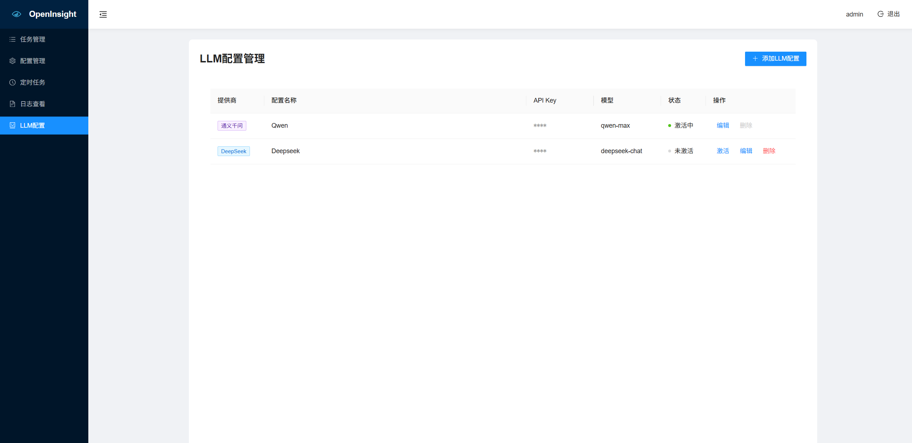
